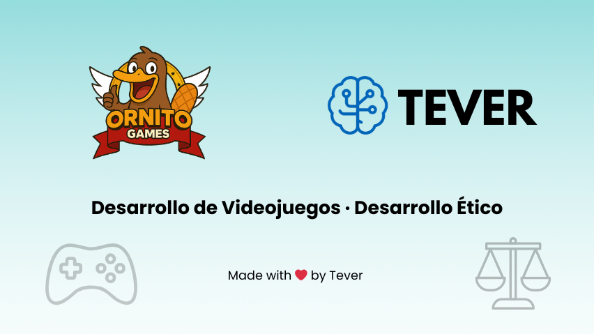

#  Hola, mi nombre es Tever 👋
### Profesor de FP & Desarrollo de Videojuegos en Ornitogames

---

Soy **Ingeniero Informático** desde 2010 y **Profesor de Formación Profesional** en informática.  
He combinado la docencia con el desarrollo de proyectos de software, siempre con un enfoque en la **innovación educativa** y las **tecnologías aplicadas al aprendizaje**.  

Puedes acceder a mis proyectos destacados en este listado:

- 🎮 Creador del canal [**OrnitoGames**](https://youtube.com/@OrnitoGames_dev?sub_confirmation=1), donde enseño cómo **crear videojuegos desde cero**.  
- 🌍 Impulsor del [**Manifiesto Ético Digital**](https://tever.es/manifiesto-etico-digital/?utm=github), explorando cómo hacer un **desarrollo responsable y respetuoso**.  

💡 Mi objetivo: **aprender enseñando, enseñar creando y crear con ética**.  

---

## 🔗 Encuéntrame en

